# 📚 Vikash Education – Android Learning Application

Vikash Education is a full-featured Android-based educational application designed to provide students with an interactive, structured, and user-friendly learning experience. The app offers video lectures, PDF notes, quizzes, bookmarking, and class switching functionality, making it suitable for a mid-level educational platform.

---

## 🚀 Features

### 🔐 Authentication
- Secure login & registration using Firebase Authentication  
- User-specific data handling and session management  

### 🎥 Video Lectures
- Class-wise and subject-wise video content  
- Smooth in-app video playback  

### 📄 PDF Notes
- Chapter-wise and subject-wise PDF materials  
- In-app PDF viewer support  

### 📝 Quiz Module
- MCQ-based quizzes for practice  
- Instant score calculation and feedback  

### 🔖 Bookmarking
- Save important videos and PDFs  
- User-specific bookmarks stored in Firebase  

### 🔁 Class Switching
- Switch between **Class 11** and **Class 12** dynamically  
- Real-time UI refresh without app restart  

### 🎨 Modern UI/UX
- Clean and responsive UI using XML layouts  
- Material Design components for better user experience  

---

## 🛠 Tech Stack

- **Language:** Kotlin, Java  
- **UI:** XML Layouts, Material Design  
- **Architecture:** MVVM  
- **Backend:** Firebase Firestore  
- **Authentication:** Firebase Auth  
- **Storage:** Firebase Storage  
- **Local Storage:** SharedPreferences  
- **Other:** RecyclerView, Fragments, Snackbar  

---

## 📸 Screenshots

| Screen 1 | Screen 2 | Screen 3 | Screen 4 |
|----------|----------|----------|----------|
| 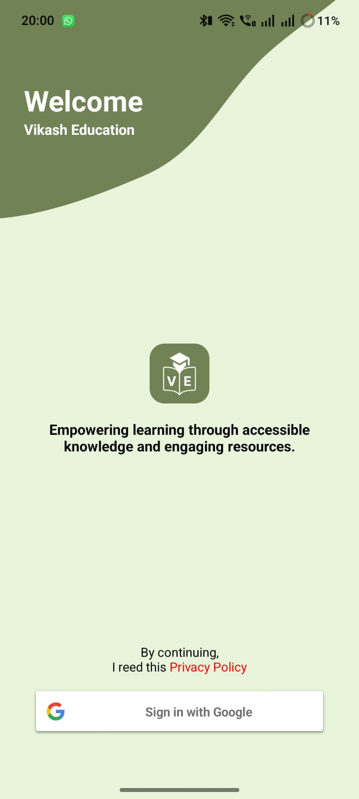 |  | 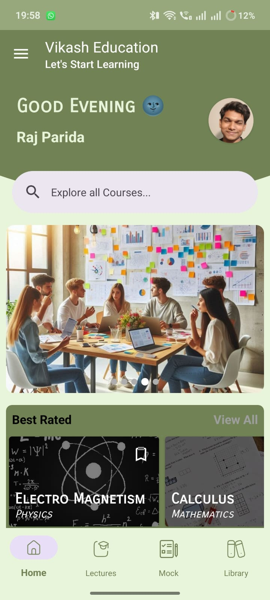 | 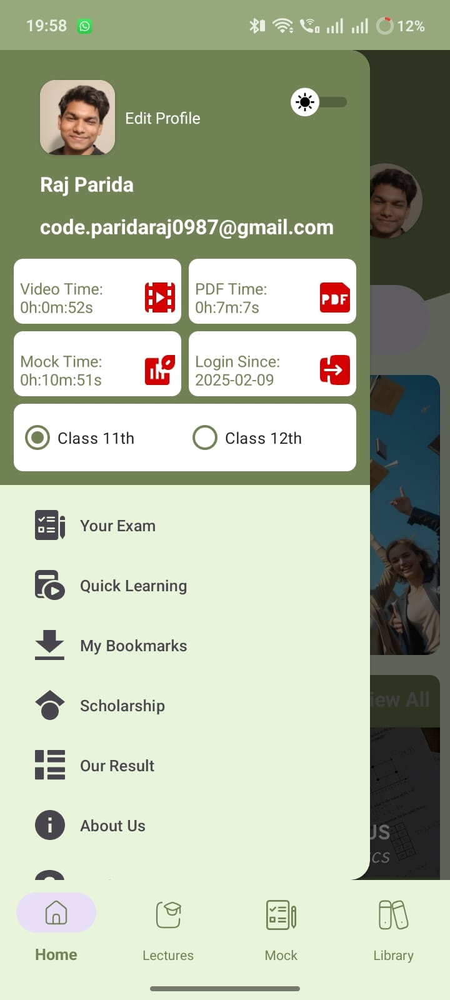 |

| Screen 5 | Screen 6 | Screen 7 | Screen 8 |
|----------|----------|----------|----------|
| 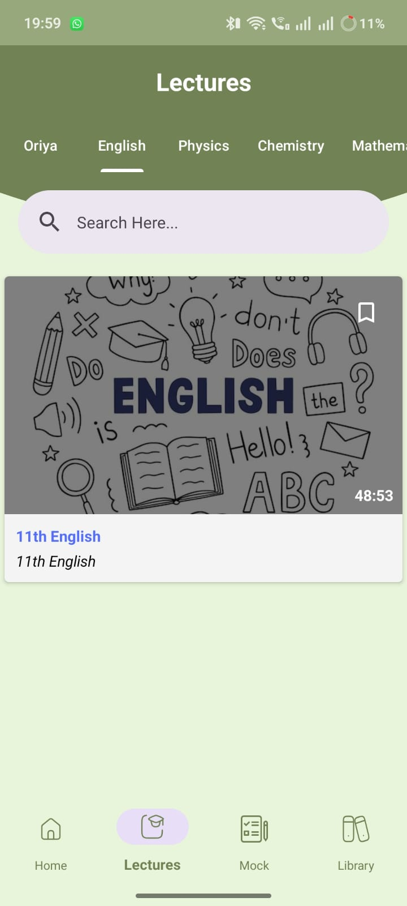 | 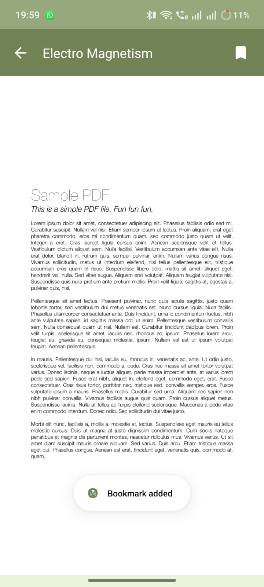 | 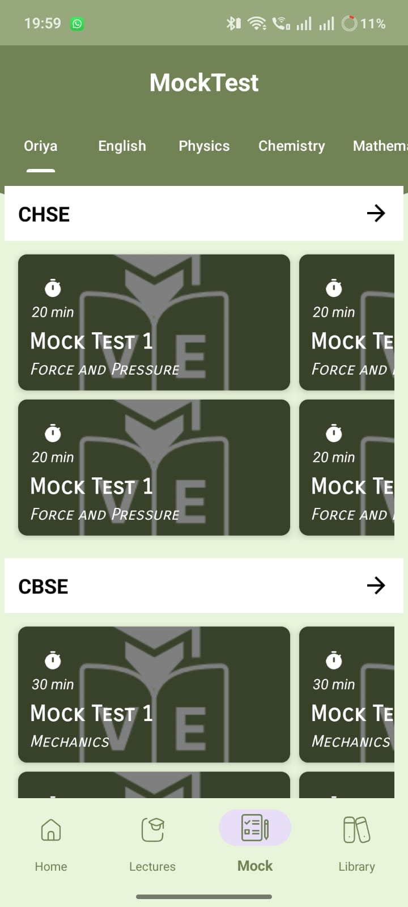 | 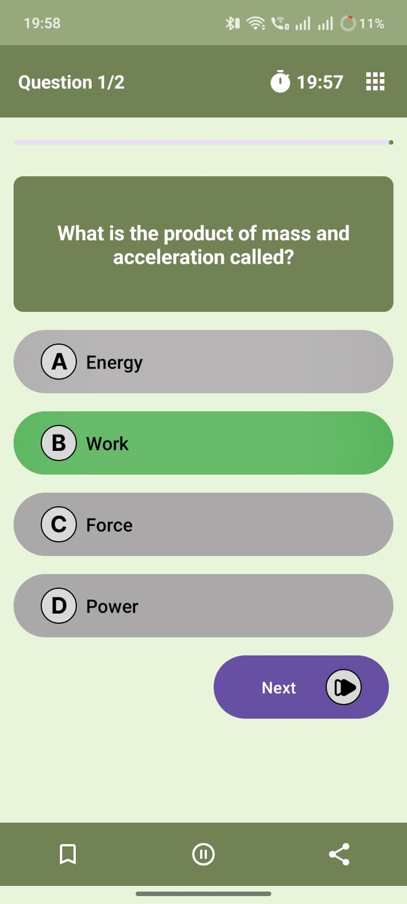 |

| Screen 9 | Screen 10 | Screen 11 | Screen 12 |
|----------|-----------|-----------|-----------|
| 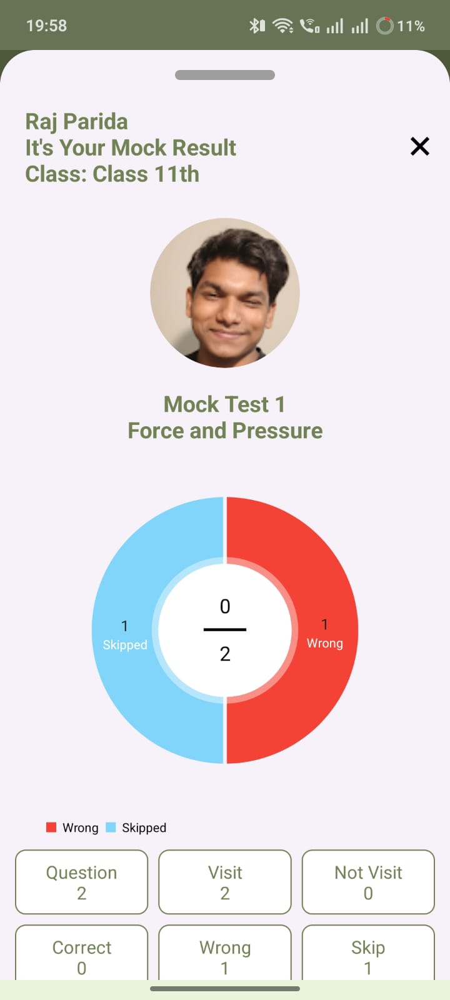 | 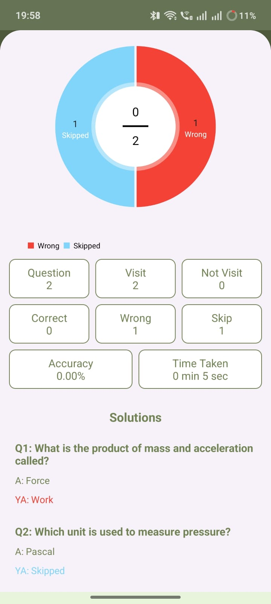 | 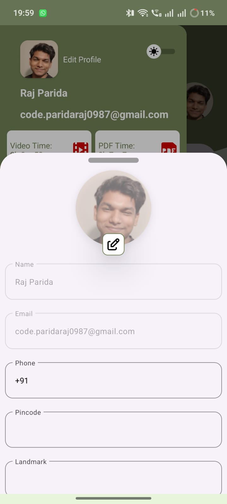 | 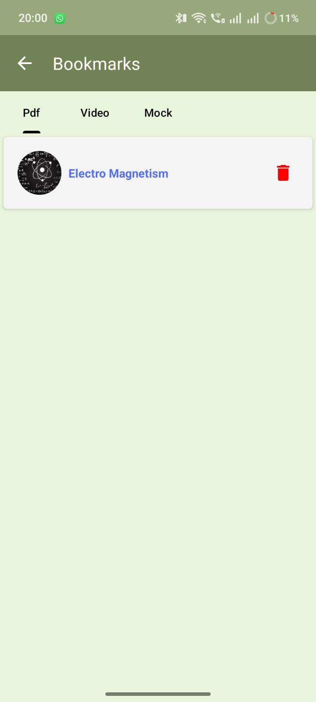 |

| Screen 13 | Screen 14 | Screen 15 | Screen 16 |
|-----------|-----------|-----------|-----------|
| 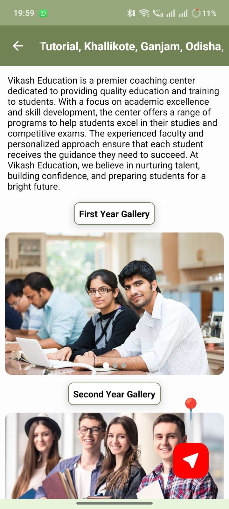 |  |  | 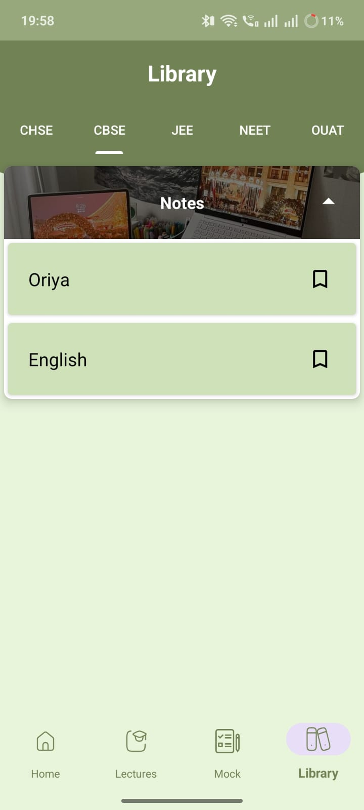 |

## 📦 APK Download

Download the APK from here:  
👉 https://www.mediafire.com/file/dmw7bf0dakz7w2o/educationApp.apk/file

## 📄 License

This project is developed for educational and learning purposes.

